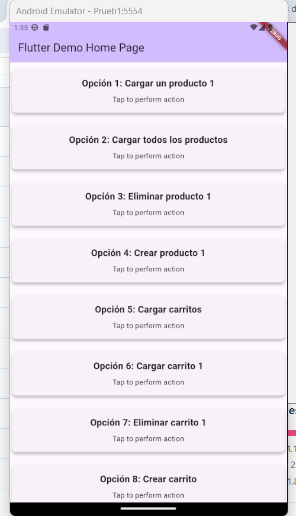
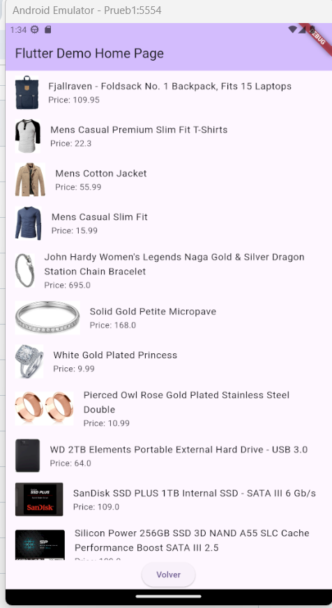
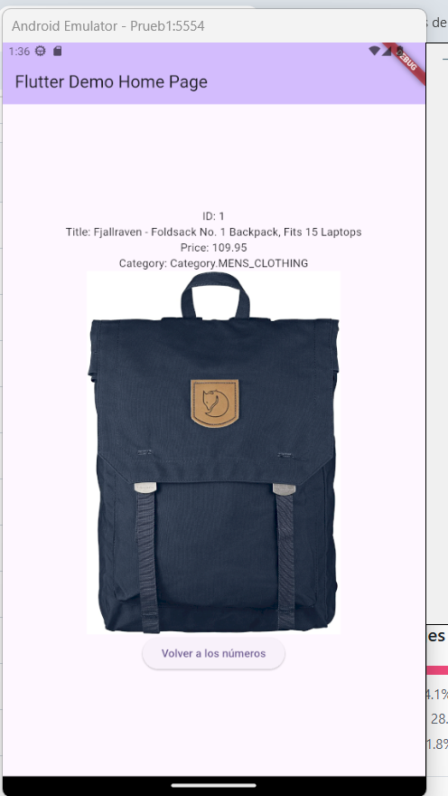
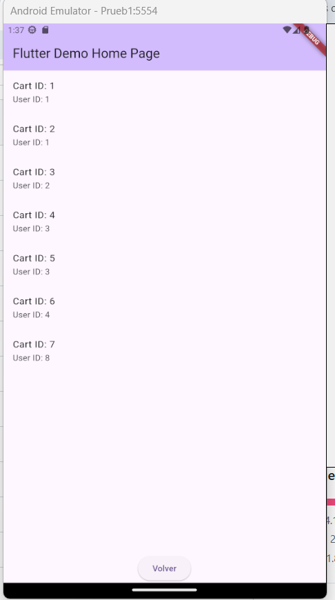
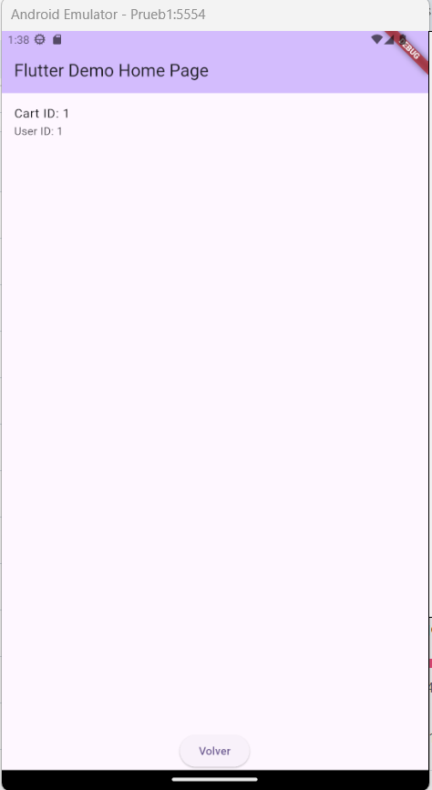

# Flutter PackagePragma Example

Este proyecto es un ejemplo de cómo usar el paquete `fake_maker_api_pragma_api` en una aplicación Flutter. Proporciona una demostración de las funcionalidades del paquete, incluyendo la gestión de productos y carritos.

## Requisitos

- Flutter SDK instalado (versión mínima recomendada: 3.0.0).
- Conexión a Internet para descargar dependencias.
- Un editor de texto o IDE como Visual Studio Code o Android Studio.

## Instalación

1. Clona este repositorio:

   ```bash
   git clone <URL_DEL_REPOSITORIO>
   ```

2. Navega al directorio del proyecto:

   ```bash
   cd packagePragma/example
   ```

3. Instala las dependencias:

   ```bash
   flutter pub get
   ```

## Ejecución

1. Para ejecutar el ejemplo en un dispositivo o emulador, utiliza el siguiente comando:

   ```bash
   flutter run
   ```

2. Selecciona el dispositivo o emulador donde deseas ejecutar la aplicación.

## Uso del paquete en el archivo `main.dart`

El archivo `main.dart` utiliza el paquete `fake_maker_api_pragma_api` para gestionar productos y carritos. Aquí tienes un ejemplo de cómo se inicializan los blocs y se manejan los estados:

```dart
import 'package:fake_maker_api_pragma_api/presentation/blocs/product_bloc.dart';
import 'package:fake_maker_api_pragma_api/presentation/initializationbloc/product_initialization.dart';
import 'package:flutter/material.dart';
import 'package:fake_maker_api_pragma_api/fake_maker_api_pragma_api.dart';

void main() {
  runApp(const MyApp());
}

class MyApp extends StatelessWidget {
  const MyApp({super.key});

  @override
  Widget build(BuildContext context) {
    return MaterialApp(
      title: 'Flutter Example',
      theme: ThemeData(
        colorScheme: ColorScheme.fromSeed(seedColor: Colors.deepPurple),
        useMaterial3: true,
      ),
      home: const MyHomePage(title: 'Flutter Demo Home Page'),
    );
  }
}

class MyHomePage extends StatefulWidget {
  const MyHomePage({super.key, required this.title});

  final String title;

  @override
  State<MyHomePage> createState() => _MyHomePageState();
}

class _MyHomePageState extends State<MyHomePage> {
  late final ProductBloc productBloc;
  late final CartBloc cartBloc;
  Product? _loadedProduct;
  final List<Product> _products = [];
  final List<Cart> _carts = [];

  @override
  void initState() {
    super.initState();
    productBloc = initializeProductBloc((productOrProducts) {
      setState(() {
        if (productOrProducts is Product) {
          _loadedProduct = productOrProducts;
        } else if (productOrProducts is List<Product>) {
          _products.clear();
          _products.addAll(productOrProducts);
        }
      });
    });

    cartBloc = initializeCartBloc((cartState) {
      // Manejo de estados de carritos
    });
    cartBloc.state.listen((state) {
      if (state is CartsLoaded) {
        setState(() {
          _carts.clear();
          _carts.addAll(state.carts);
        });
      }
    });
  }

  @override
  Widget build(BuildContext context) {
    return Scaffold(
      appBar: AppBar(
        title: Text(widget.title),
      ),
      body: Center(
        child: Column(
          mainAxisAlignment: MainAxisAlignment.center,
          children: [
            // Implementación de UI
          ],
        ),
      ),
    );
  }
}
```

## Imágenes de Ejecución

A continuación, se muestran capturas de pantalla de la aplicación Flutter en ejecución:

1. **Pantalla Principal**  
   

2. **Lista de Productos**  
   

3. **Detalles del Producto**  
   

4. **Lista de Carritos**  
   

5. **Detalles del Carrito**  
   

## Licencia

Este proyecto está bajo la licencia MIT. Consulta el archivo `LICENSE` para más detalles.


